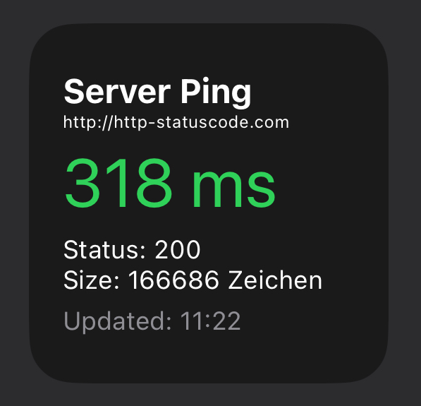

# Scriptable Server Ping Widget

This widget for the Scriptable app displays the ping time, HTTP status code, and response size for a specified server. It's designed for quick monitoring of server response and availability.

## Features

- **Ping Measurement**: Shows the time taken (in milliseconds) to receive a response from the server.
- **HTTP Status Code**: Displays the status code of the HTTP response.
- **Response Size**: Indicates the size of the server's response in characters.
- **Last Updated Time**: Provides the time when the widget was last updated.

## Installation

1. **Download Scriptable**: Ensure that you have the [Scriptable app](https://apps.apple.com/app/scriptable/id1405459188) installed on your iOS device.
2. **Add the Script**: Open Scriptable and tap on the "+" icon to create a new script.
3. **Copy and Paste**: Copy the script provided below and paste it into the new script in Scriptable.

## Usage

- Edit the `const ip = "localhost";` line in the script to point to your desired server.
- Run the script in Scriptable to see the widget preview.
- Add the widget to your home screen for continuous monitoring.


[Example http-statuscode.com](https://http-statuscode.com)


## Script

```javascript
const ip = "http-statuscode.com"; // Replace with your server's IP
const url = `http://${ip}`;

// ... [rest of the script] ...

main();```

## Customization

You can customize the script by changing the server IP address or modifying the widget's appearance according to your preference.

## Contribution

Contributions, suggestions, and feedback are welcome. Please feel free to fork, comment, or open an issue on this repository.

## License

This script is released under the MIT License. See [LICENSE](LICENSE) for more information.
